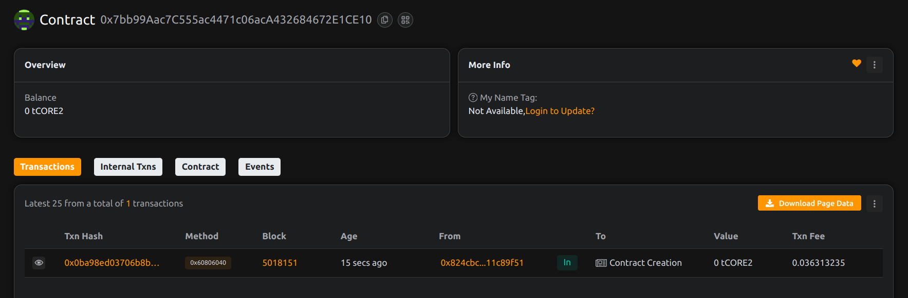

.# Project Title: BountyVault: Immutable Bug Bounty Platform

## Project Description.

BountyVault is a smart contract platform  for securely managing and distributing bug bounties. It ensures that bounty funds are held in escrow until valid submissions are verified and claimed by the bounty hunter.

## Project Vision.

.To build a trustless and transparent system for incentivizing ethical hackers and developers to find vulnerabilities without depending on centralized services.

## Key Features.

- On-chain bounty listings
- Escrowed reward funds
- Admin-controlled claim approval
- Public bounty metadata and payout tracking
 
## Future Scope.

- DAO-based bounty verification and voting
- NFT proof-of-claim for bounty winners
- GitHub/webhook integration for auto-tracking submissions
- Multi-network bounty syndication

## Contract Details.
project done by ritik raj.
project done by ritik raj.
0x7bb99Aac7C555ac4471c06acA432684672E1CE10
.
